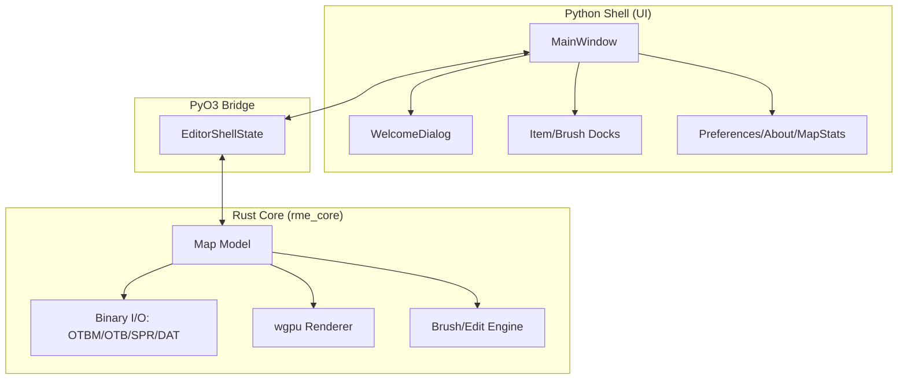

# 🐺 Noct Map Editor

<p align="center">
  
  
  
  
  
</p>

> **Noct** is the spiritual successor to [Remere's Map Editor: Redux](https://github.com/karolak6612/remeres-map-editor-redux). It reimagines the "Redux" vision using a Rust-powered core and a premium, glassmorphic Python/PyQt6 shell.

---

## 📖 Table of Contents
- [Overview](#-overview)
- [Legacy Ground Truth](#-legacy-ground-truth)
- [Architecture](#-architecture)
- [Key Features](#-key-features)
- [Development Stack](#-development-stack)
- [Quick Start](#-quick-start)
- [Contributing & Community](#-contributing--community)
- [Issues & Tags](#-issues--tags)
- [License](#-license)

---

## ✨ Overview

Noct is designed for extreme performance and visual excellence. It continues the mission of the C++ Redux project—modernizing the OT community's gold standard—but pivots to a safer, more concurrent memory model (Rust) and a highly extensible UI framework (PyQt6).

- **Rust-First Core**: All map data, binary I/O (OTBM/OTB), and heavy computations live in Rust.
- **Python Visual Shell**: The UI is built with PyQt6, following the **Obsidian Cartographer** design system.
- **GPU Rendering**: Leverages `wgpu` for hardware-accelerated map display.

---

## 🏛️ Legacy Ground Truth

Noct treats **[Remere's Map Editor: Redux](https://github.com/karolak6612/remeres-map-editor-redux)** (C++) as the authoritative reference for behavior contracts.

- **Parity Goal**: Every feature implemented in Noct must match or exceed the technical standard set by the C++ Redux implementation.
- **Logic Sync**: When in doubt regarding OTBM parsing, brush resolution, or similarity-finder algorithms, we consult the legacy C++ source.
- **Divergence**: While we aim for parity, Noct introduces modern UX patterns (Glassmorphism, Async UI) that go beyond the legacy WxWidgets interface.

---

## 🏗️ Architecture



---

## 🛠️ Key Features

- [x] **Glassmorphic UI**: Premium theme with deep amethyst accents and translucent backgrounds.
- [x] **Tier 2 UI Parity**: (Preferences, About, Town/House Managers).
- [x] **OTBM Persistence**: Robust read/write for v0-v3 OTBM files.
- [/] **wgpu Renderer**: Real-time tile primitive rendering (Async sprite loading batching).
- [ ] **Brush Engine**: (In Progress) Porting legacy C++ autoborder and terrain resolution.

---

## 🚀 Quick Start

### 1. Prerequisites
- Python 3.12+
- Rust (Stable 2021+)
- Node.js 22+ (for GSD workflow)

### 2. Setup
```powershell
# Clone the repo
git clone https://github.com/Marcelol090/rme-noct.git
cd rme-noct

# Initialize dev environment
npm install
bash scripts/setup-devtools.sh

# Build Rust bridge
maturin develop
```

### 3. Launch
```bash
python -m pyrme
```

---

## 🤝 Contributing & Community

Noct uses an **Agentic Development Workflow**. All contributions must follow the [AGENTS.md](AGENTS.md) contract and respect the legacy reference logic.

- **TDD First**: Every feature must have associated Python/Rust tests.
- **Legacy Parity**: Verify logic against the `remeres-map-editor-redux` source before implementation.
- **GSD Workflow**: Use `.gsd/` for planning and milestone tracking.

---

## 🏷️ Issues & Tags

We use a structured tagging system to manage the migration and development lifecycle.

### Issue Labels
- `feat/ui`: UI components or design system updates.
- `feat/core`: Rust backend functionality or I/O.
- `bug/parity`: Deviations from legacy RME Redux behavior.
- `task/gsd`: Internal workflow or infrastructure tasks.

---

## 📜 License

Distributed under the **GNU GPL v3 License**. See `LICENSE` for more information.

---
<p align="center">
  <i>Inspired by the work of karolak6612 and the RME community.</i>
</p>
