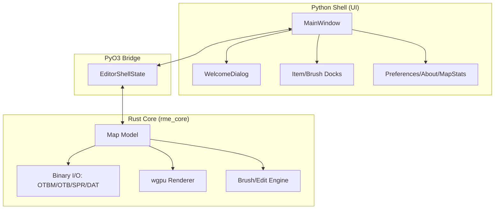

# 🐺 Noct Map Editor

<p align="center">
  
  
  
  
  
</p>

> A high-performance rewrite of **Remere's Map Editor (RME)** featuring a Rust-powered core and a modern, glassmorphic Python/PyQt6 shell.

---

## 📖 Table of Contents
- [Overview](#-overview)
- [Architecture](#-architecture)
- [Key Features](#-key-features)
- [Development Stack](#-development-stack)
- [Quick Start](#-quick-start)
- [Contributing & Community](#-contributing--community)
- [Issues & Tags](#-issues--tags)
- [License](#-license)

---

## ✨ Overview

Noct is designed for performance and aesthetics. It bridges the gap between the legacy power of RME and modern software architecture.

- **Rust-First Core**: All map data, binary I/O (OTBM/OTB), and heavy computations live in Rust.
- **Python Visual Shell**: The UI is built with PyQt6, following the **Obsidian Cartographer** design system (glassmorphism, no-line rule).
- **GPU Rendering**: Leverages `wgpu` for hardware-accelerated map display.

---

## 🏗️ Architecture

Noct uses a decoupled architecture to separate UI concerns from performance-critical operations.



---

## 🛠️ Key Features

- [x] **Glassmorphic UI**: Premium theme with deep amethyst accents and translucent backgrounds.
- [x] **Tier 2 UI Parity**:
    - `Preferences`: Dashboard for General, Graphics, and Interface settings.
    - `About`: Project branding and metadata.
    - `Town Manager`: Full integration with backend town state.
    - `House Manager`: Complete house management system.
- [x] **OTBM Persistence**: Robust read/write for v0-v3 OTBM files and XML sidecars (spawns, houses).
- [/] **wgpu Renderer**: Real-time tile primitive rendering (Ground/Walls/Items).
- [ ] **Brush Engine**: (In Progress) Autobordering, terrain, and object brushes.

---

## 🚀 Quick Start

### 1. Prerequisites
- Python 3.12+
- Rust (Stable 2021+)
- Node.js 22+ (for GSD workflow)

### 2. Setup
```powershell
# Clone the repo
git clone https://github.com/Marcelol090/rme-noct.git
cd rme-noct

# Initialize dev environment
npm install
bash scripts/setup-devtools.sh

# Build Rust bridge
maturin develop
```

### 3. Launch
```bash
python -m pyrme
```

---

## 🤝 Contributing & Community

Noct uses an **Agentic Development Workflow**. All contributions must follow the [AGENTS.md](AGENTS.md) contract.

- **TDD First**: Every feature must have associated Python/Rust tests.
- **Design Consistency**: Respect the "No-Line Rule" and theme tokens in `pyrme/ui/theme.py`.
- **GSD Workflow**: Use `.gsd/` for planning and milestone tracking.

---

## 🏷️ Issues & Tags

We use a structured tagging system to manage the migration and development lifecycle.

### Issue Labels
- `feat/ui`: UI components or design system updates.
- `feat/core`: Rust backend functionality or I/O.
- `bug/parity`: Deviations from legacy RME behavior.
- `task/gsd`: Internal workflow or infrastructure tasks.

### Tag Lifecycle
- `v0.x`: Alpha phases (Core I/O, Basic Canvas).
- `v1.0-alpha`: Full legacy menu parity.
- `v1.0-beta`: Functional brush engine and toolset.

---

## 📜 License

Distributed under the **GNU GPL v3 License**. See `LICENSE` for more information.

---
<p align="center">
  <i>Built with 💜 by the Noct Community</i>
</p>
